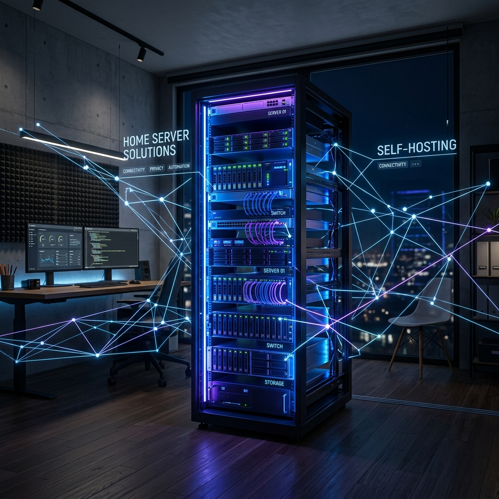

# 🌌 Noble1 Homelab
**A robust, self-hosted sandbox for personal learning and infrastructure experimentation.**

---

## 🎯 Purpose & Philosophy
This homelab is a **personal learning environment** designed for hands-on experience with enterprise networking, system administration, and DevOps practices. 

It serves as a playground for:
- **Experimentation**: Testing new software and configurations before deployment.
- **Skill Building**: Mastering Docker, Unraid, and Linux-based infrastructure.
- **Independence**: Reducing reliance on third-party cloud services through self-hosting.

---

## 🛠️ Hardware Ecosystem
Our infrastructure is built on enterprise-grade hardware, optimized for high availability and mass storage.

| Component | Specification | Description |
| :--- | :--- | :--- |
| **Server** | 🖥️ Dell PowerEdge R720 | 2U Rackmount Chassis |
| **Processor** | 🧠 2x Intel Xeon E5-2650 | 16 Cores / 32 Threads Total |
| **Memory** | 💾 96GB DDR3 ECC | Error-correcting enterprise RAM |
| **Storage** | 🗄️ 56TB Usable | Mixed array of 4TB and 14TB drives |
| **Parity** | 🛡️ 1x 16TB | Single drive redundancy protection |
| **Cache** | ⚡ 1TB NVMe SSD | High-speed application & write cache |
| **Networking** | 🌐 Ubiquiti Dream Machine Pro | Core Gateway & Controller |
| **Switch** | 🔌 USW-24-PoE | 24-Port Managed Gigabit PoE Switch |
| **Power** | 🔋 2U Rackmount UPS | Uninterruptible Power Supply |
| **Interface** | 🏎️ 10GbE SFP+ | High-throughput server backbone |

---

## 🚀 Service Stack
Currently hosting **60+ services** categorized for maximum efficiency.

### 🎬 Media & Entertainment
- **Plex / Jellyfin**: Centralized media streaming.
- **The Arrs**: Sonarr, Radarr, Lidarr, Prowlarr for automated acquisition.
- **Overseerr**: Request management system for users.

### 🏠 Home Automation & IoT
- **Home Assistant**: The brain of the smart home.
- **Zigbee2MQTT**: Device bridge for local control.
- **Grafana / InfluxDB**: Environment monitoring and dashboards.

### 🔐 Identity & Security
- **Authentik**: Centralized Identity Provider (IdP) providing SSO and OAuth2/OIDC for all supported services.
- **Vaultwarden**: Secure, self-hosted password management.
- **Cloudflare Tunnels**: Secure external access without opening firewall ports.

### 🛠️ Infrastructure & Utilities
- **Pi-hole / AdGuard Home**: Network-wide ad blocking.
- **Nextcloud**: Personal cloud storage and document collaboration.
- **Uptime Kuma**: Monitoring and heartbeat tracking.

---

## 📊 Maintenance & Automation
- **Backups**: Automated off-site backups via Rclone to encrypted cloud storage.
- **Updates**: Controlled deployments using Watchtower for non-critical containers.
- **Monitoring**: Real-time alerts via Discord webhooks for system health.

---

  Built with ❤️ and a lot of caffeine.

